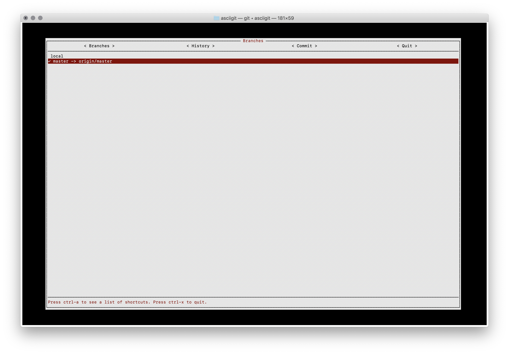
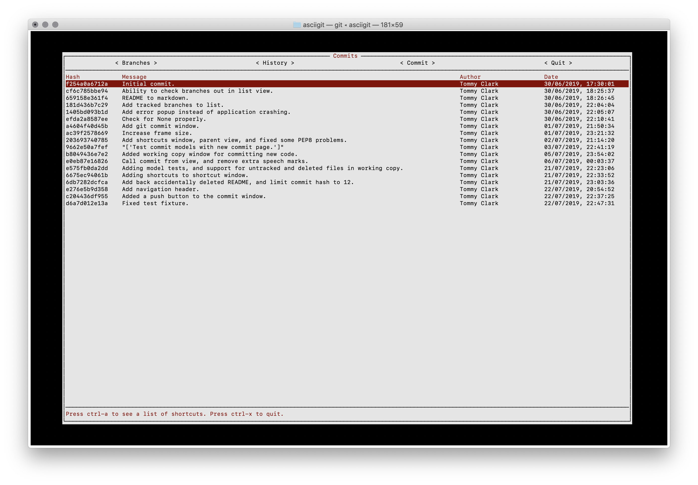
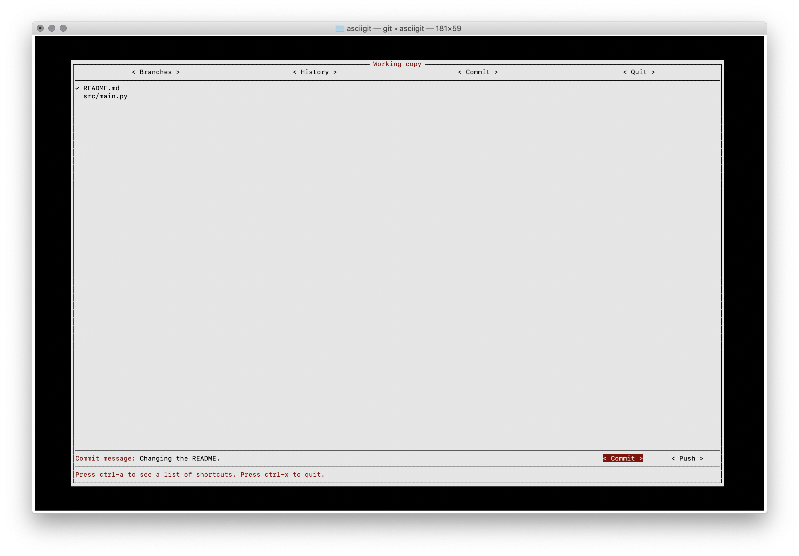

[](https://travis-ci.com/tommyclark/asciigit) [](https://pypi.org/project/asciigit)

       _            _ _       _ _   
      /_\  ___  ___(_|_) __ _(_) |_ 
     //_\\/ __|/ __| | |/ _` | | __|
    /  _  \__ \ (__| | | (_| | | |_ 
    \_/ \_/___/\___|_|_|\__, |_|\__|
                        |___/       
          
# Asciigit

Asciigit is a terminal UI for [Git](https://git-scm.com). The aim of this project is to make it easier
for you to interact with your Git repositories in the terminal, either
locally or when connected to a remote server over SSH.

## How to open
Navigate to the directory containing the Git repository you want to open, and
run:

```shell
asciigit
```

## How to use
Either use your mouse to click around the terminal interface, or use the tab 
and enter buttons to navigate the screens.

There's also a key binding for ctrl-a that'll open up a shortcuts window.

### Screenshots
Hit enter on a branch to check that branch out.


View the commit history of your current branch.


Select the files you want to commit by hitting enter on them,
and then enter a commit message and commit and push at the bottom
of the window.


## Installation
You can install this application via [pip](https://pypi.org/project/asciigit):
```
pip install asciigit
```
